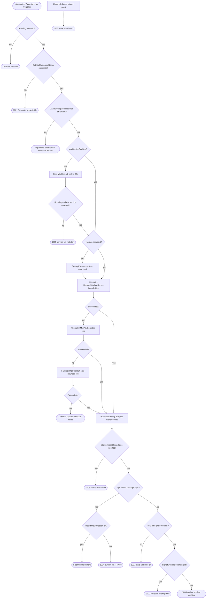

# Architecture

Written for the engineer who has just opened a queue of failed checks and needs
to know what this script did and why. Start at the [exit code
contract](#exit-code-contract) — it is the section that resolves most tickets.

## Problem statement and blast radius

**What it solves.** N-sight's Antivirus Update Check compares Defender's
signature age against a threshold. A device that was powered off over the
weekend boots Monday, the Daily Safety Check runs before Defender has pulled
current definitions, and the check fails. Nothing is wrong with the device.
This script re-triggers the update, waits for it to land, and reports what it
found.

**Where it runs.** Every managed Windows endpoint with Defender as the active
AV, as an Automated Task, as SYSTEM, under the Advanced Monitoring Agent. It is
triggered by check failure rather than on a schedule, so on a healthy estate it
runs rarely — and on a bad Monday it runs on hundreds of devices within the
same hour.

**Blast radius if it misbehaves.**

- It writes nothing outside Defender's own preferences, and only with
  `-Harden`. Without that switch the script is read-only apart from asking
  Defender to update itself.
- The failure mode that scales badly is a wrong exit code, not a wrong action:
  a false non-zero on hundreds of devices is a ticket storm. Finding 4 in the
  1.0.0 audit was exactly this — passive-mode Defender reported `1004` on every
  device running a third-party AV. 1.1.0 detected the case and reported `1001`
  for it, which named the cause but kept the storm; 1.2.0 exits `0` there and
  leaves the explanation in the log.
- Each run can trigger a definition download. On an estate behind a single
  WSUS or a metered link, a synchronised Monday morning means a synchronised
  burst of definition traffic. The script does not stagger itself; if that
  matters, stagger it in the RMM.
- The script never reboots, never disables anything, and never touches Tamper
  Protection.

## Execution model

1. The Antivirus Update Check fails on a device.
2. N-sight fires the Automated Task attached to that check with the frequency
   method **On Check Failure**.
3. The agent runs the script as **SYSTEM**. There is no user context, no
   desktop, and no way to prompt — hence no `Read-Host` anywhere in the script.
4. All output goes to **stdout as one stream**. `Write-Verbose` is deliberately
   not used: the agent captures stdout, and a second stream that might be
   dropped is worse than no second stream.
5. The **process exit code** becomes the task result. Zero is a pass; anything
   else marks the task failed and raises a ticket carrying the log.
6. A passing run does not itself clear the alert. The underlying **Antivirus
   Update Check** clears on its next execution, once it sees current
   definitions. So `0` here means "the next check should pass", not "the ticket
   is closed".

Execution policy applies to the agent exactly as it does to an interactive
session — see the README for the two supported ways to handle that.

## Control flow

In prose:

**Pre-flight.** Elevation first, because without it every downstream failure
lies about its cause. Then `Get-MpComputerStatus`, which fails outright if the
Defender module or WMI provider is not there. Then `AMRunningMode`, which is
the only reliable way to tell "Defender is the AV and it is behind" from
"Defender is dormant because another product owns this device". The second case
exits `0`: the device is healthy, nothing on it can be remediated, and a
non-zero code there raises a ticket that no change to the device could ever
clear. The property does not exist before platform 4.18.2011, and its absence
is logged and treated as inconclusive rather than as passive — refusing to run
on old platforms would be worse than the false positive it prevents. If the AM
service is off, the script starts `WinDefend` and polls for `Running`, then
re-reads status rather than assuming the start took.

**Harden.** Optional, and the only thing the script writes. `Set-MpPreference`
is applied and then read back with `Get-MpPreference`, because policy-managed
values are silently overridden at read time rather than rejected at write time.

**Update.** Three methods in order, each in its own background job with a
`-UpdateTimeoutSeconds` ceiling. The first success ends the phase.

**Verify.** Polls `Get-MpComputerStatus` every 5 seconds up to `-WaitSeconds`
and stops as soon as the age is within threshold. Real-time protection and
signature-version movement are then evaluated together to pick the exit code.

## Exit code contract

Codes `1001`–`1005` keep the meanings they had in 1.0.0. `1006`–`1008` were
added in 1.1.0 and split cases that used to be reported as `1002` or `1004`.
`0` widened in 1.2.0: passive-mode Defender moved from `1001` to `0`, because
the device is healthy and the code is read by an alerting system, not by a
person. See the CHANGELOG for the reasoning.

| Code | Meaning | Likely cause | First diagnostic step | Auto-recoverable |
|------|---------|--------------|-----------------------|------------------|
| `0` | Definitions current with real-time protection on, **or** Defender is passive behind a third-party AV. | Device was simply behind and the update landed; or another AV product owns the device and Defender is dormant by design. | None for the device. Read the log's `Running mode` line to tell the two apart. If it is not `Normal`, fix the monitoring scope — this device should not be running an AV check that reads Defender. | Yes — nothing to recover |
| `1001` | Defender not present, service unavailable, or the script is not elevated. | Defender disabled by policy; Tamper Protection blocking service start; task not configured to run as SYSTEM. | Read the log's elevation line, then the service-start lines. | No — needs a config change |
| `1002` | New definitions applied but still older than `-MaxAgeDays`. | Update source only offers older definitions; endpoint clock skew; `-MaxAgeDays 0` on a device that just updated to yesterday's build. | Compare the before/after version lines, then check the device clock and the source's own definition age. | Sometimes — a later run may pass |
| `1003` | Every update method failed or timed out. | No egress, proxy requiring authentication SYSTEM cannot supply, WSUS not approving definition updates. | `netsh winhttp show proxy` on the device, then check WSUS approvals for Definition Updates. | No |
| `1004` | Definitions current, real-time protection off. | RTP disabled by policy, by a user with rights, or left off after troubleshooting. | `Get-MpPreference \| Select-Object DisableRealtimeMonitoring` and check for a managing policy. | No |
| `1005` | Unexpected/unhandled error. | A genuine defect or an environment nobody anticipated. | Read the stack trace in the log. Any `1005` is a bug report. | No |
| `1006` | Defender status could not be re-read after a successful update. | WMI provider unhealthy, `WinDefend` stopped mid-run, repository corruption. | `Get-MpComputerStatus` by hand; if it fails, this is a Defender health issue, not a definitions issue. | No |
| `1007` | Definitions stale **and** real-time protection off. | Defender degraded on both axes; often a half-removed third-party AV. | Treat as the highest priority of the failure codes. Check RTP first, definitions second. | No |
| `1008` | Update method reported success but the signature version never moved. | WSUS approving nothing, an internal definition share serving stale content, or a source that returns success with no payload. | Check what the configured source is actually offering — this is a source problem, not an endpoint problem. | No |

## Function reference

**On "public".** The script is a standalone `.ps1` — no manifest, no
`Export-ModuleMember`, and dot-sourcing it executes the remediation rather than
importing anything. Nothing below has an exported surface; every function is
script-scope and reachable only from within a run. They are documented here
because they are the units the [control flow](#control-flow) is assembled from,
and the places an exit code is actually decided. The README's *Internal
functions* section covers the same six from the editing perspective — parameter
defaults, binding details — and is the place to look before changing a
signature.

One convention explains most of those signatures. `Write-Log` writes to the
success stream, which is also a function's return path, so a helper that both
logs and produces a result would have its log lines swallowed by the caller's
assignment. Those helpers return nothing and hand the result back through a
`[ref]` parameter instead, which is why the log arrives on stdout as the run
progresses rather than in a batch at the end.

| Function | Signature | Phase | Result path |
|----------|-----------|-------|-------------|
| `Write-Log` | `-Message <string>` (mandatory; `AllowNull`, `AllowEmptyString`) | All | Writes one `[yyyy-MM-dd HH:mm:ss] <message>` line to stdout. Returns nothing. |
| `Test-IsElevated` | none | Pre-flight | Returns `[bool]`. |
| `Get-MpCmdRunPath` | none | Update (method 3) | Returns a path `[string]`, or `$null`. |
| `Invoke-JobWithTimeout` | `-Description <string>`, `-ScriptBlock <scriptblock>`, `-TimeoutSeconds <int>`, `-ResultRef <ref>` (all mandatory), `-ArgumentList <object[]>` (default `@()`) | Update (all three methods) | `-ResultRef`; `$null` means no usable answer. |
| `Wait-ForServiceRunning` | `-Name <string>`, `-TimeoutSeconds <int>`, `-IsRunningRef <ref>` (all mandatory), `-IntervalSeconds <int>` (default `2`) | Pre-flight (service start) | `-IsRunningRef` `[bool]`. |
| `Wait-ForSignatureRefresh` | `-MaxAgeDays <int>`, `-TimeoutSeconds <int>`, `-StatusRef <ref>` (all mandatory), `-IntervalSeconds <int>` (default `5`) | Verify | `-StatusRef`; the last status object read, or `$null`. |

### `Write-Log`

The script's only output path — there is no verbose or warning stream to
enable, for the reason given under [Execution model](#execution-model). It
coerces `$null` to an empty string before formatting: `MpCmdRun.exe` emits
blank lines, a mandatory `[string]` implicitly rejects `''`, and the binding
exception would surface through the outer catch as `1005` — the fallback update
path dying through its own logging. The full date is included because RMM logs
are read days later, often from another time zone.

### `Test-IsElevated`

Runs before anything else touches Defender. SYSTEM's token is a member of
`BUILTIN\Administrators`, so this is true under the agent as well as in an
elevated console. **Decides `1001`** on the non-elevated path. Checking it
first is the whole point: without elevation both `Update-MpSignature` attempts
fail on access denied, and the run would otherwise report `1003` and send the
technician to inspect a proxy and a WSUS that are both fine.

### `Get-MpCmdRunPath`

Locates the executable for the third update method. Prefers the active platform
under `%ProgramData%\Microsoft\Windows Defender\Platform`, whose folders are
named after their version, selecting the highest name parsed as a `[version]` —
a trailing `-<digits>` suffix is stripped, and an unparseable name sorts as
`0.0`. Sorting on the parsed version rather than `LastWriteTime` matters
because that directory accumulates old platform versions and the timestamp gets
touched by unrelated activity. Falls back to
`%ProgramFiles%\Windows Defender\MpCmdRun.exe`, then `$null`. A `$null` return
skips the fallback method entirely, which on a run where methods 1 and 2 have
already failed **means `1003`**.

### `Invoke-JobWithTimeout`

The containment boundary for every update attempt, and the reason the script
cannot outlive the agent's task timeout. Runs the scriptblock in a background
job under a hard ceiling and writes the job's last non-null output to
`-ResultRef`. `$null` covers three cases the callers treat alike: the job could
not be started, it did not finish within `-TimeoutSeconds`, or it returned
nothing. A failure to *start* is logged distinctly, because it is a job
infrastructure problem on the endpoint — constrained language mode, a broken
component — rather than the definition delivery failure that `1003` otherwise
implies; see [Known limitations](#known-limitations). The job is stopped and
removed in a `finally` on every path out, so nothing accumulates across the
three attempts. Stopping a timed-out job terminates the child process; any
download Defender started on its own carries on, which is Defender's business
and not this script's.

Worst case is three calls at `-UpdateTimeoutSeconds` each — six minutes at the
default — before the run reports `1003`.

### `Wait-ForServiceRunning`

Polls a service until it reports `Running` or the ceiling expires, replacing a
fixed sleep that was either wasted agent time or too short. Sets
`-IsRunningRef` to `$true` on the first `Running` reading and returns
immediately; otherwise leaves it `$false`. A missing service is logged per poll
rather than treated as a distinct outcome. Each sleep is clamped to the time
remaining, so the ceiling is a real bound rather than the ceiling plus one
interval.

Called once, for `WinDefend`, with the script constant
`$ServiceStartTimeoutSeconds` (30) — deliberately not a parameter, because a
service that has not started in 30 seconds is not going to. Its result is
logged but does not by itself decide the exit code: the script re-reads
`Get-MpComputerStatus` afterwards and it is Defender's own view of the AM
service that **decides `1001`**, so the log distinguishes "the service never
started" from "the service started and Defender still reports its AM service as
disabled".

### `Wait-ForSignatureRefresh`

The entire Verify phase. Polls `Get-MpComputerStatus` until the signature age
is at or under `-MaxAgeDays` or the ceiling expires, and writes the last status
object it managed to read to `-StatusRef` (`$null` if it never read one).
Keeping the last *successful* reading means a single failed poll at the end of
the window does not discard an earlier answer. A status object that reports no
age is logged and does not end the loop. Sleeps are clamped as above, so
`-WaitSeconds` is a ceiling rather than a lower bound and a device that updates
in two seconds does not hold the agent's task open for twenty. Called with the
script constant `$PollIntervalSeconds` (5).

Every terminal code from the Verify phase is decided on what this writes to
`-StatusRef`: a `$null` object or a `$null` age **is `1006`**, and the age,
real-time protection state and signature-version movement then select between
`0`, `1002`, `1004`, `1007` and `1008`.

### The two update scriptblocks

`$UpdateSignatureScript` and `$MpCmdRunScript` are script-scope variables
rather than functions, because each runs in its own runspace and so cannot see
anything defined above it. Both catch their own failures and return a
structured object rather than letting `Receive-Job` decide how an error should
surface.

| Scriptblock | Argument | Returns |
|-------------|----------|---------|
| `$UpdateSignatureScript` | `$UpdateSource` — `MicrosoftUpdateServer` or `MMPC` | `[pscustomobject]` with `Succeeded` `[bool]` and `Message`. |
| `$MpCmdRunScript` | `$ExePath` — from `Get-MpCmdRunPath` | `[pscustomobject]` with `Lines` (stdout and stderr, as strings) and `ExitCode` (`$null` if the process never ran). |

`$MpCmdRunScript` relaxes `$ErrorActionPreference` to `Continue` for itself
only: at `Stop`, redirected stderr from a native command becomes a terminating
`NativeCommandError` in Windows PowerShell 5.1, which would report `1005` where
`1003` is the truth. It also removes any inherited `$LASTEXITCODE` before
launching, rather than assigning `0` — which would create a script-scope shadow
the engine never updates — so a stale value from an earlier command cannot make
a failed launch look like a successful update. A `$null` `ExitCode` is
therefore a real signal, and the caller treats it as a failed attempt.

## Failure modes and design rationale

**No network.** Both `Update-MpSignature` attempts fail fast, `MpCmdRun.exe`
returns non-zero, and the run reports `1003` with a message naming egress,
proxy and WSUS. The script does not try to diagnose connectivity itself — no
test endpoints, no pings — because a remediation script that probes the network
becomes a network monitoring tool that nobody asked for and that trips
egress alerts at scale.

**Proxy requiring authentication.** SYSTEM has no user credentials to present.
This surfaces as `1003`. This is not fixable in the script; the WinHTTP proxy
configuration for the machine account is the right place.

**WSUS not approving definition updates.** `MicrosoftUpdateServer` succeeds at
the transport level and delivers nothing, or fails. That is why `MMPC` is tried
next — it goes straight to Microsoft and routes around the approval problem —
and why `1008` exists: an update that "succeeded" without moving the version
number is a source problem, and it deserves a different ticket than a device
that genuinely cannot reach anything.

**Tamper Protection.** Blocks `Start-Service WinDefend` even for SYSTEM, and
returns a generic access denial that reads like any other permissions error.
The script keeps the `try/catch` and names Tamper Protection in the log line so
the technician does not spend twenty minutes checking ACLs. It does not attempt
to disable it: that is by design impossible from script, and rightly so.

**Third-party AV in passive mode.** `Get-MpComputerStatus` succeeds,
`AMServiceEnabled` is `$true`, `RealTimeProtectionEnabled` is correctly
`$false`. Reading only those two properties produces a confident `1004` on a
perfectly healthy machine. `AMRunningMode` is checked before anything else
touches Defender, and anything other than `Normal` exits `0` with a log line
that points at the monitoring configuration rather than the device.

The exit code moved from `1001` to `0` in 1.2.0. 1.1.0 detected the condition
correctly and then still failed the task on it, which left the estate with the
same ticket storm the detection existed to prevent — just with a better log
line inside it. A passive device has nothing to remediate: Defender's
definitions and real-time protection are supposed to look stale and off there,
no rerun will change that, and no engineer touching the device can clear the
alert. The honest signal is "this check does not apply here", and in an RMM
that is `0` plus a log line, not a failure code. The device still needs
excluding from the Antivirus Update Check or pointing at the AV that actually
owns it; the log says so on every run, where it can be found by searching task
output rather than by working a queue of false alerts.

**Defender disabled by policy.** Either `Get-MpComputerStatus` fails, or the
service refuses to start and stays disabled. Both paths exit `1001` within the
30-second service poll rather than proceeding to an update that cannot work.

**Agent task timeout.** The reason every update method runs in a job. An
unbounded `Update-MpSignature` against a dead WSUS can block for minutes; if
the agent's timeout fires first, the process is killed and the log is lost —
leaving a failed task with no explanation, which is the one outcome that
guarantees a wasted hour. Worst case the script now spends
`3 x UpdateTimeoutSeconds` (six minutes at the default) plus `-WaitSeconds`
before exiting cleanly with `1003`. **Keep that total below the agent's task
timeout**; lower `-UpdateTimeoutSeconds` if your agent is configured tighter.

**Non-elevated execution.** Checked first, exits `1001`. Previously this
produced `1003` and sent the technician to inspect a proxy and a WSUS that were
both fine.

## Why the update methods are ordered as they are

| Order | Method | Talks to | Why here |
|-------|--------|----------|----------|
| 1 | `Update-MpSignature -UpdateSource MicrosoftUpdateServer` | The device's configured Windows Update target — WSUS if one is set, Microsoft Update otherwise. Honours WinHTTP proxy config. | Respects local infrastructure first. On a correctly configured estate this is the only method that runs, and definitions come from the server the device is supposed to use. |
| 2 | `Update-MpSignature -UpdateSource MMPC` | Microsoft's definition endpoint directly over HTTPS. | Routes around WSUS entirely. This is the one that saves the Monday morning when WSUS has not approved this week's definitions. It still needs egress and proxy to work. |
| 3 | `MpCmdRun.exe -SignatureUpdate` | Defender's own configured fallback order, in-process to the AM engine. | Bypasses the PowerShell module and the WMI layer, so it can still work when those are unhealthy — a genuinely different failure surface, not just a third try at the same thing. Located under `%ProgramData%\Microsoft\Windows Defender\Platform`, picking the highest **parsed version** folder, since that directory accumulates old platform versions and `LastWriteTime` gets touched by unrelated activity. |

## State and idempotency

**Mutates:** only `SignatureUpdateInterval` and `SignatureUpdateCatchupInterval`,
and only with `-Harden`. Both are set to fixed values, so re-running converges
rather than drifting.

**Reads:** `Get-MpComputerStatus`, `Get-MpPreference`, `Get-Service WinDefend`,
and the Defender platform directory listing.

**Side effects:** asks Defender to update its own definitions, and starts
`WinDefend` if it is stopped. Both are operations Defender performs on its own
schedule anyway.

**Repeated runs are safe.** No files are written, no registry keys are set
directly, no state is carried between runs, and nothing accumulates. Two
concurrent runs on the same device would both call into the same Defender
update mechanism, which serialises internally; the second simply reports that
definitions are current. Background jobs are removed in a `finally` block on
every path, including timeout, so nothing is left behind in the runspace.

## Known limitations

- **`AMRunningMode` on old platforms.** Absent before platform 4.18.2011.
  Passive-mode detection silently does not work there. Logged as inconclusive
  and allowed to continue, on the grounds that failing closed on an old but
  healthy platform is worse than the false positive.
- **`Start-Job` dependency.** If the job infrastructure cannot start (heavily
  constrained language mode, a broken WinRM-adjacent component), every update
  attempt fails with a job error and the run reports `1003`. The log line names
  the job failure specifically, but the exit code is arguably misleading. Not
  fixed, because an in-process fallback would reintroduce the unbounded-hang
  problem that the jobs exist to solve.
- **`AntivirusSignatureAge` is whole days.** A threshold of `0` is effectively
  "updated today", and clock skew on the endpoint shifts it. There is no
  sub-day granularity available from this property.
- **Definition traffic is not staggered.** By design; belongs in the RMM
  schedule, not in the script.
- **Execution policy is not handled by the script.** Deliberately. A script
  that bypasses its own execution policy is a script that has defeated a
  control. Handle it with the Automation Manager object or code signing, both
  documented in the README.
- **`-Harden` cannot beat policy.** It writes the local preference and reports
  the effective value; where GPO or Intune manages the setting, the local value
  is inert. The fix belongs in policy.
- **`1005` should be unreachable.** Every known failure surface is handled. Any
  occurrence is a defect, not an environment quirk.

## Testing notes

On a lab VM with a snapshot to roll back to:

| Path | How to provoke it |
|------|-------------------|
| `0` | Set the clock back a few days, or run with `-MaxAgeDays 30` on any healthy device. |
| `1001` not elevated | Run from a non-elevated PowerShell session as a standard user. |
| `0` passive AV | Install any third-party AV that registers with Security Center; confirm with `(Get-MpComputerStatus).AMRunningMode`. Expect exit `0` and a `Running mode` line that is not `Normal`. |
| `1001` service down | With Tamper Protection **off**: `sc.exe config WinDefend start= disabled`, then `sc.exe stop WinDefend`, then reboot. |
| `1002` | Run with `-MaxAgeDays 0` on a device whose definitions are a day old and whose source has nothing newer. |
| `1003` | Add an outbound firewall rule blocking `MpCmdRun.exe` and `svchost`, or point the device at a nonexistent WSUS via the `WUServer` policy. |
| `1003` via timeout | Block the WSUS host with a **DROP** rule rather than a reject — connections then hang instead of failing fast, which is what exercises the job timeout. Use a low `-UpdateTimeoutSeconds` to keep the test short. |
| `1004` | With Tamper Protection off: `Set-MpPreference -DisableRealtimeMonitoring $true`. |
| `1006` | Stop `WinDefend` immediately after the update phase begins, so the verification polls have nothing to read. Narrow window; expect a few attempts. |
| `1007` | Combine the `1004` and `1002` setups on the same VM. |
| `1008` | Point the device at a WSUS that approves no definition updates while its own definitions are stale. |

**Cannot be safely or realistically simulated:**

- **Tamper Protection blocking service start.** Turning it on is easy; getting
  a deterministic test out of it is not, and it cannot be scripted off
  afterwards — the toggle is interactive or Intune-managed by design. Verify
  the log wording by inspection instead.
- **A proxy that requires authentication.** Needs a real authenticating proxy
  in the lab path; a mock will not reproduce SYSTEM's credential problem
  faithfully.
- **EDR Block Mode.** Requires a licensed Defender for Endpoint tenant.
- **`1005`.** There is no supported way to force it, which is the point.
- **Production WSUS approval states.** Do not test approval changes against a
  production WSUS to exercise `1008`.
